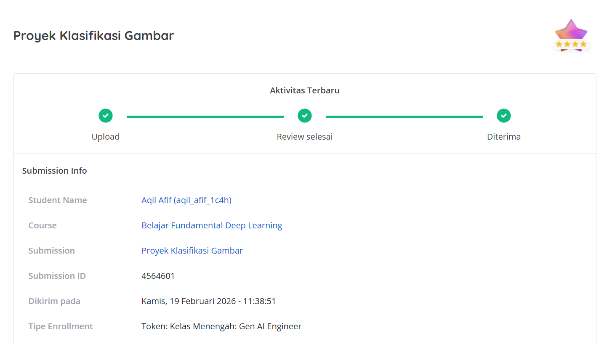

# Proyek Klasifikasi Gambar (Image Classification) 🖼️

Proyek ini merupakan submission untuk pengembangan model *Machine Learning* menggunakan arsitektur *Convolutional Neural Network* (CNN) untuk mengklasifikasikan gambar. Proyek ini dikembangkan oleh **Aqil Afif**.

## 📌 Hasil Review & Checklist Submission

Berikut adalah kriteria submission yang telah diimplementasikan dan berhasil dipenuhi dalam proyek ini:

- ✅ **Bebas Memilih Dataset yang Ingin Dipakai, tetapi Harus Memiliki Minimal 1000 Gambar**
- ✅ **Tidak Diperbolehkan Menggunakan Dataset Rock, Paper, Scissor dan X-Ray**
- ✅ **Dataset Dibagi Menjadi Train Set, Test Set dan Validation Set**
- ✅ **Model Harus Menggunakan Model Sequential, Conv2D, Pooling Layer**
- ✅ **Akurasi pada Training dan Testing Set Minimal Sebesar 85%**
- ✅ **Membuat Plot Terhadap Akurasi dan Loss Model**
- ✅ **Menyimpan Model ke Dalam Format SavedModel, TF-Lite dan TFJS**

### Bukti Hasil Review

## 🚀 Deskripsi Proyek

Proyek ini bertujuan untuk membangun model AI yang mampu mengenali dan mengklasifikasikan gambar dengan tingkat akurasi tinggi (di atas 85%). Prosesnya mencakup pra-pemrosesan gambar, augmentasi data, dan pembagian dataset menjadi *train*, *test*, serta *validation set* untuk mencegah *overfitting*. 

Model yang telah dilatih kemudian diekspor ke berbagai format produksi untuk kebutuhan *deployment*, yaitu:
1. **SavedModel**: Untuk deployment di server/backend.
2. **TensorFlow Lite (TF-Lite)**: Untuk deployment di perangkat *mobile* (Android/iOS) atau IoT.
3. **TensorFlow.js (TFJS)**: Untuk deployment langsung di *browser* / aplikasi web.

## 🛠️ Teknologi dan Library yang Digunakan

- **Bahasa Pemrograman**: Python
- **Machine Learning Framework**: TensorFlow, Keras
- **Arsitektur Model**: Sequential (Conv2D, MaxPooling2D, Flatten, Dense)
- **Visualisasi Data**: Matplotlib (untuk plot metrik akurasi dan loss)
- **Manipulasi Data**: NumPy, Pandas

## 📈 Evaluasi Model

Selama proses pelatihan, performa model dipantau menggunakan plot visual. Model telah berhasil mencapai batas minimum akurasi 85% baik pada data latih (*training*) maupun data uji (*testing*), menunjukkan bahwa model dapat menggeneralisasi data dengan baik.
